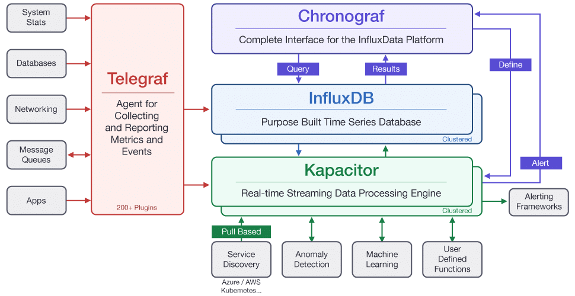
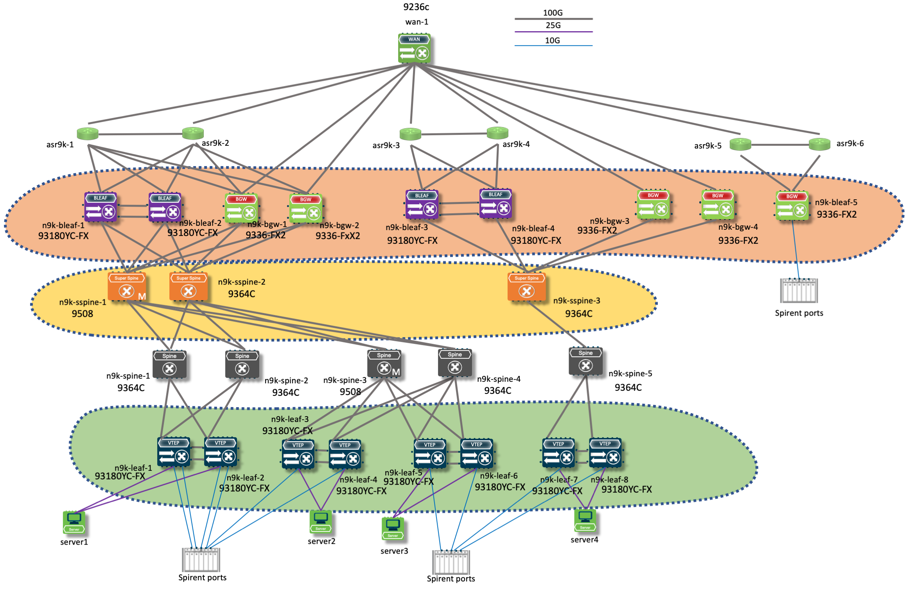
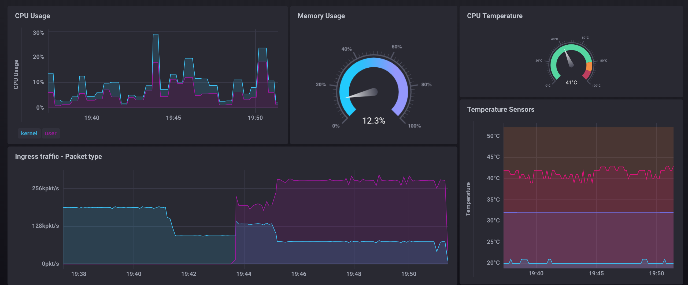
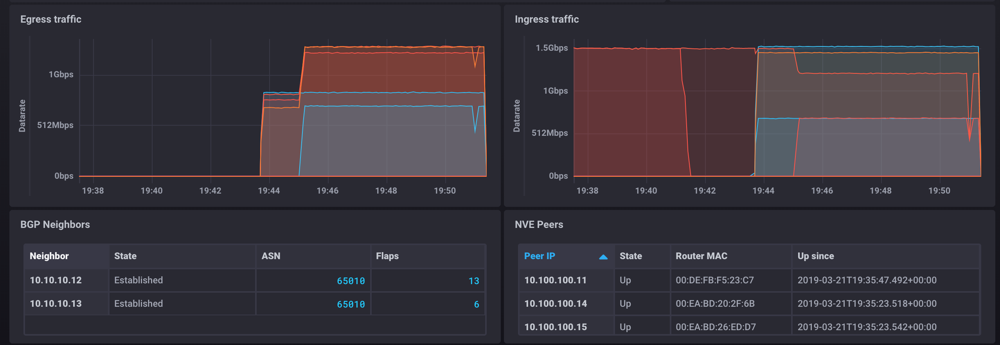
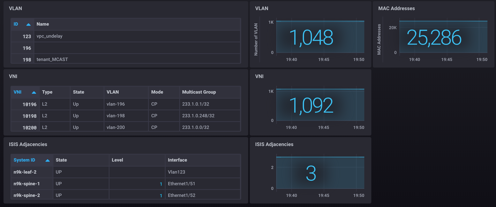
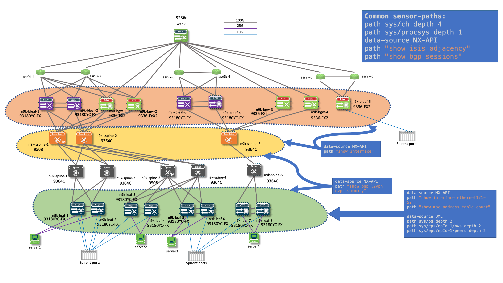

# NX-OS Telemetry with TICK stack


> TICK stack reference: <https://www.influxdata.com/time-series-platform/>

The Telemetry stack used in this repo includes a collector (Telegraf), a time-series database (InfluxDB) and a WebUI to build and visualise dashboards (Chronograf).

This repository uses the Cisco MDT Telegraf plugin available at: <https://wwwin-github.cisco.com/spa-ie/telegraf>

## Quick start

Ensure Docker (<https://docs.docker.com/install/>) and Docker Compose (<https://docs.docker.com/compose/install/>) are installed on your system.
Then run `docker-compose up -d` in this repository to have Chronograf, InfluxDB and Telegraf containers running.

> To quickly import dashboards in Chronograf, you can use the [import-dashboards](./import-dashboard) Bash script that will import all the JSON files in the [dashboards](./dashboards) folder into Chronograf. You need to install the [jq](https://stedolan.github.io/jq/) tool on your system in order to use this script.

> To access the Influx CLI and perform queries, you need to run the `/usr/bin/influx` command in the InfluxDB container. See [influx-cli](./influx-cli) one-line script.

## Setup architecture

The configurations and pre-baked dashboards in this repository aim to monitor the following setup.



For all the nodes, we monitor the CPU and Memory Usage, the CPU temperature and the traffic on all the interfaces (monitoring both bitrate and packetrate, with a distinction between unicast and multicast traffic for the latest). We also monitor the routing protocols sessions (here ISIS adjacancies and BGP neighbors).

The **green** nodes are leaves. In addition to the aforementioned items, we monitor the MAC address table size, the NVE peers, the BGP L2VPN EVPN routes number and the configured VLANs and VNI with their states.

The **yellow** nodes are super spines that have the BGP route reflectors role. In addition to the aforementioned items, we monitor the BGP L2VPN EVPN routes number.

## Dashboards





> Because of the NX-API sensor-paths used for traffic monitoring, the measurements in the time-series database are different between a node with a leaf role (VLAN filtered) and a non-leaf role. See the _Limitations_ section for more details on the reason of this choice.

- Dashboard for non-leaf node: _Cisco Nexus Telemetry - Device View.json_
  - CPU Usage (Stacked - User and Kernel Usage - Percentage)
  - Memory Usage (Gauge - Percentage)
  - CPU Temperature (Line - Supervisor slots temperatures | Gauge - Mean of the supervisor slots temperatures)
  - Total Ingress Traffic (Stacked - Sum of multicast and unicast ingress traffic on all interfaces - Packetrate)
  - Egress Traffic (Line - Egress traffic on all interfaces - Bitrate)
  - Ingress Traffic (Line - Ingress traffic on all interfaces - Bitrate)
  - BGP Neighbors (Table - BGP Neighbor with Neighbor ID, State, ASN and # Flaps)
  - BGP EVPN L2VPN Prefixes (Line + Single Stat - Sum of received prefixes from all BGP neighbors)
  - ISIS Adjacencies (Table - ISIS Ajacencies with System ID, State, Level and Interface | Line + Single Stat - Count of the previous table with State = 'UP')
- Dashboard for leaf node: _Cisco Nexus Telemetry - Device View - Leaf.json_
  - **Same cells as previous dashboard**
  - NVE Peers (Table - Peer IP, State, Router MAC and Up timestamp)
  - VLAN (Table - ID and Name | Line + Single Stat - Count of the previous table)
  - VNI (Table - VNI, Type, State, VLAN, Mode and Multicast Group | Line + Single Stat - Count of the previous table)
  - MAC Addresses (Line + Single Stat - Count of MAC address table)
- Global dashboard of the fabric: _VXLAN EVPN Fabric.json_
  - Ingress Traffic per Room (Line - Ingress bitrate on all interfaces and all leaves of the room, grouped by device and interface)
  - Total Traffic per Room (Line - Sum of the previous cell for the room)
  - L2VNI (Line + Single Stat - Count of the L2VNI with status Up on all leaves)
  - L3VNI (Line + Single Stat - Count of the L3VNI with status Up on all leaves)
  - BGP Neighbors (Line - Number of BGP neighbors grouped by device, filtered to include route reflectors only)
  - BGP EVPN L2VPN Routes (Line - Sum of received prefixes from all BGP neighbors grouped by device, filtered to include route reflectors only)

## NX-OS Configuration



### Leaf

The full configuration file is [leaf.conf](./configs/leaf.conf). Change [TELEGRAF_IP] with the IP address of the host running the Telegraf container.

### Border Gateway and Border Leaf

The full configuration file is [border.conf](./configs/border.conf). Change [TELEGRAF_IP] with the IP address of the host running the Telegraf container.

### Super Spine (BGP Route Reflector)

The full configuration file is [sspine.conf](./configs/sspine.conf). Change [TELEGRAF_IP] with the IP address of the host running the Telegraf container.

### Guidelines

When designing Telemetry configuration, several points should be taken into account.

- **The number of metrics sent by one device, within one message**
  - Collectors like Telegraf write metrics withing time-series database (InfluxDB) by batch. If a message coming from a device contains more metrics than the batch size, the metrics will reach the time-series database after several writes. The consequences depends on the queries done on the time-series database, but we may have temporary wrong query result before all the writes occurs.
  - _Example_: when streaming a MAC address table, the number of metrics increases while the number of learned MAC address increases.
  - _Possible solutions_: Filter out the number of metrics sent on the device (using a DME query-condition like `target-subtree-class`) or scale the collector horizontally (several Telegraf instances writing in one unique InfluxDB instance - potentially clustered).
- **The maximum size of the messages sent by the devices**
  - When the table becomes important, a message size can reach the default 4MB limit of a gRPC message. Telegraf configuration needs to be updated.

## Limitations

- DME refresh time for interface statistics is 36 seconds. NX-API must have to be used: not optimal to reduce the collection time.
- No multi-threading: considering a sensor group, collection time gets higher because other sensor groups are configured with a clashing interval time. This leads to spikes in calculated derivatives.
- Some fields on the DME have changing types (<https://wwwin-github.cisco.com/spa-ie/telegraf/issues/2>).
  Other example:

  ``` log
  2019-03-12T16:34:56Z E! [outputs.influxdb]: when writing to [http://influxdb:8086]: received error partial write: field type conflict: input field "passwdType" on measurement "sys/bgp/inst/dom-default/bgpDom//bgpPeer" is type string, already exists as type integer dropped=3; discarding points
  ```

- FIXME: When using target-subtree-class in query-condition, no data is receivedi in InfluxDB: e.g. `path sys/intf query-condition query-target=subtree&target-subtree-class=rmonIfIn,rmonIfOut,rmonIfHCIn,rmonIfHCOut,rmonEtherStats`

## Debug guidelines

- [telegraf.conf](telegraf/telegraf.conf) modifications

  ``` conf
  [[inputs.cisco_telemetry_mdt]]
    ## For debugging purpose, dump the raw GPB payload
    dump_raw_input = "/tmp/telegraf/dump"
  [[outputs.file]]
    ## Ouput the data to a file.
    ## For debugging purpose, consumes significant CPU resources.
    files = ["stdout"]
  [agent]
    ## Telegraf debug verbosity level
    debug = true
  ```

  > You can use a file in the `/tmp/telegraf` directory instead of stdout to prevent flooding the Docker logs.

- [docker-compose.yml](docker-compose.yml) modifications

  ``` docker-compose
      telegraf:
          build: telegraf
          volumes:
            - ./telegraf/telegraf.conf:/etc/telegraf/telegraf.conf:ro
            - /tmp/telegraf:/tmp/telegraf # For debugging purpose
  ```